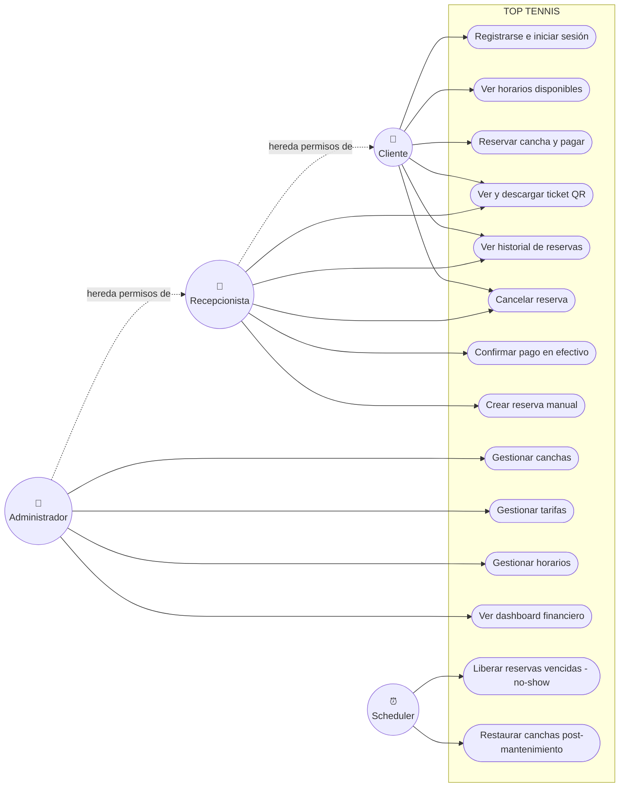
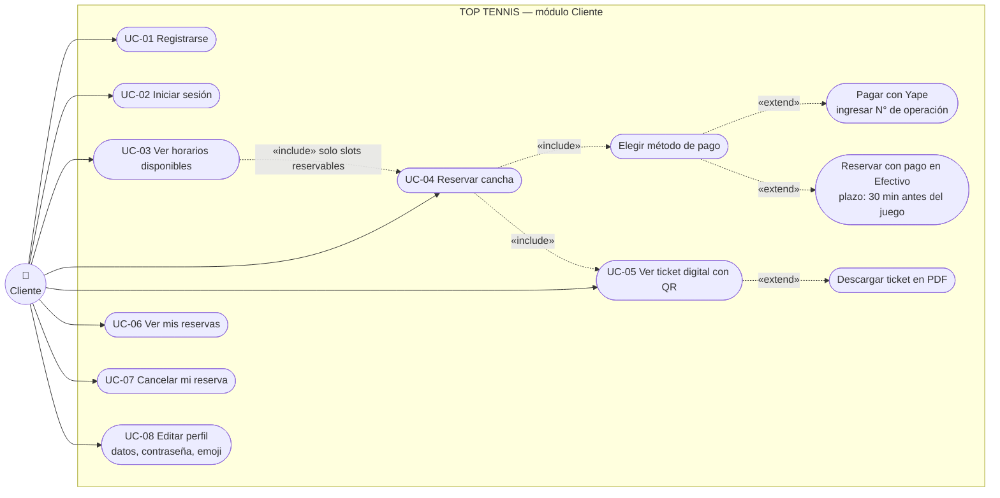
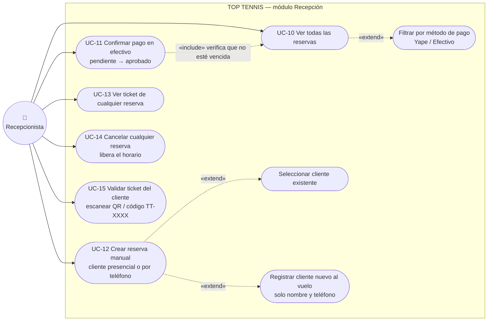
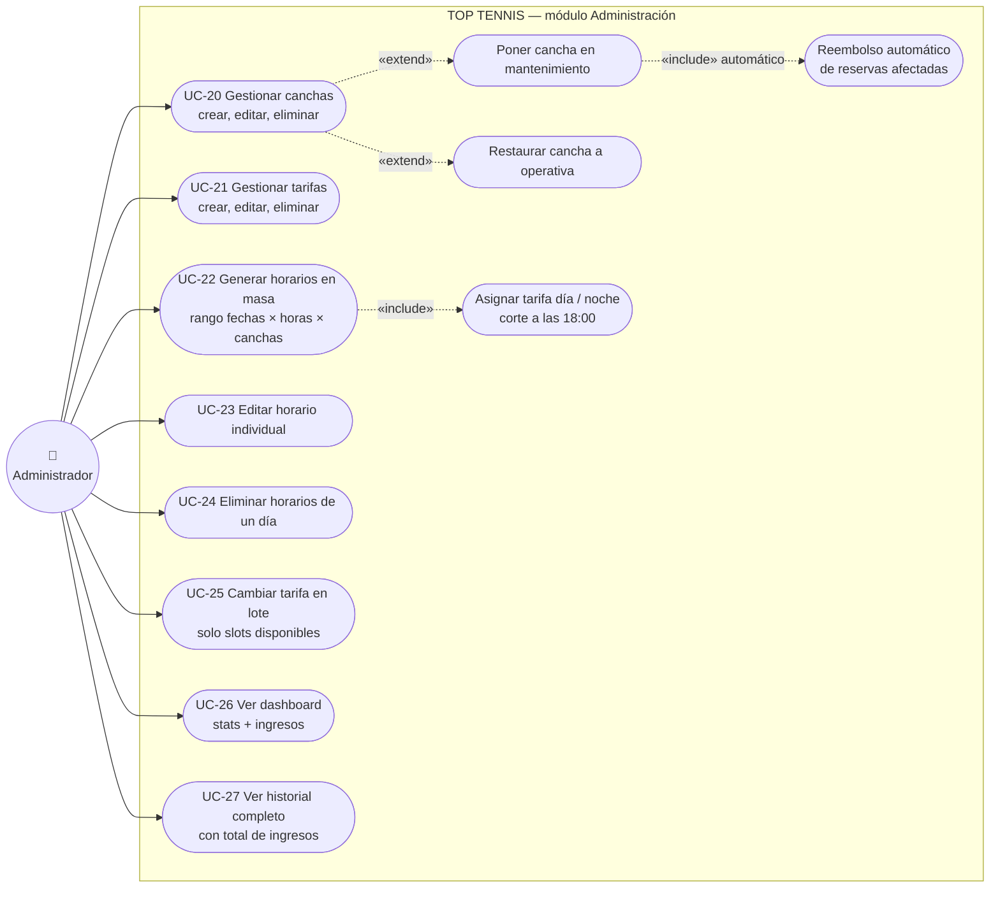
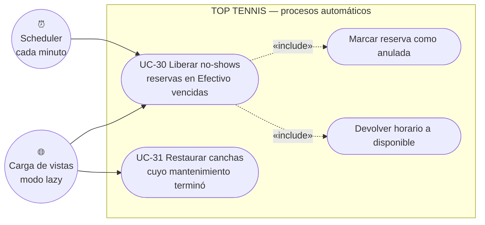

# Diagramas de Casos de Uso — Top Tennis

> **VS Code:** abrí este archivo y presioná `Ctrl+Shift+V` para ver los diagramas renderizados.
> Complementa a [DIAGRAMA-ER.md](DIAGRAMA-ER.md) (datos) y a [INDEX.md](INDEX.md) (código).

---

## Actores del sistema

| Actor | Descripción | Cómo se identifica en el código |
|---|---|---|
| **Cliente** | Usuario registrado que reserva canchas y paga (Yape o Efectivo) | `users.rol = 'cliente'` ([Rol.php](app/enums/Rol.php)) |
| **Recepcionista** | Personal del club: atiende el mostrador, cobra en efectivo y registra reservas presenciales | `users.rol = 'recepcionista'` |
| **Administrador** | Dueño/gestor del club: configura canchas, tarifas y horarios; ve las finanzas | `users.rol = 'admin'` |
| **Scheduler (tiempo)** | Actor no humano: el Task Scheduler de Laravel dispara procesos automáticos cada minuto | [console.php](routes/console.php) + [LiberarReservasVencidas.php](app/Console/Commands/LiberarReservasVencidas.php) |

**Jerarquía de permisos:** `Admin` hereda todo lo que puede hacer `Recepcionista`, y ambos (staff) además pueden hacer todo lo que hace un `Cliente` (reservar para sí mismos, ver su perfil, etc.). El middleware [RoleMiddleware.php](app/Http/Middleware/RoleMiddleware.php) es quien lo hace cumplir ruta por ruta.

---

## 1. Diagrama general del sistema

---

## 2. Casos de uso del CLIENTE

**Reglas visibles para el Cliente:**
- Solo ve horarios `disponibles`, a futuro y de canchas `operativas` (scope `reservables()` en [Horario.php](app/Models/Horario.php)).
- Si paga con **Yape**, la reserva queda `aprobado` al instante y el N° de operación no puede repetirse (constraint `UNIQUE`).
- Si elige **Efectivo**, la reserva queda `pendiente` y caduca 30 min antes de la hora de juego si no paga en recepción.
- Solo puede ver/cancelar/descargar **sus propias** reservas (método `autorizar()` en [ReservaController.php](app/Http/Controllers/ReservaController.php)).

---

## 3. Casos de uso del RECEPCIONISTA

**Reglas del Recepcionista:**
- Solo puede confirmar pagos de reservas **en Efectivo** y **pendientes**; si la reserva ya caducó (`estaVencida()`), el sistema lo rechaza.
- En la reserva manual el pago se registra como `aprobado` directo (el cobro ocurre en el mostrador).
- Si registra un cliente nuevo, el sistema le genera email y contraseña aleatorios internos ([ReservaController.php](app/Http/Controllers/ReservaController.php), `storeManual()`).
- **No puede** entrar a los CRUD de canchas, tarifas ni horarios: el middleware `role:admin` lo redirige al dashboard con mensaje de error.

---

## 4. Casos de uso del ADMINISTRADOR

**Reglas del Administrador:**
- No puede eliminar una **cancha** o **tarifa** con horarios asociados (integridad referencial + chequeo en el controlador).
- No puede editar ni eliminar un **horario reservado** (primero hay que cancelar la reserva).
- Al poner una cancha **en mantenimiento** con fecha de fin, las reservas `aprobadas` dentro del rango pasan a `cancelado_por_mantenimiento` y se registra el reembolso de cada una en el log — todo en una transacción ([CanchaController.php](app/Http/Controllers/CanchaController.php), `ponerMantenimiento()`).
- El **ingreso total** del dashboard suma `monto_pagado` (precio congelado al reservar), nunca el precio actual de la tarifa.

---

## 5. Casos de uso del SCHEDULER (procesos automáticos)

**Doble disparo (defensa en profundidad):** la misma lógica corre por dos vías para que la regla se cumpla aunque el scheduler no esté activo en Windows/XAMPP:
1. **Scheduler:** `Schedule::command('reservas:liberar-vencidas')->everyMinute()->withoutOverlapping()` en [console.php](routes/console.php).
2. **Modo lazy:** `Reserva::liberarVencidas()` y `Cancha::restaurarVencidas()` se llaman al inicio de las vistas clave (`disponibles()`, `confirmar()`, `canchas.index`).

---

## 6. Especificaciones detalladas (formato académico)

### UC-04 — Reservar cancha (el caso de uso central)

| Campo | Detalle |
|---|---|
| **Actor principal** | Cliente |
| **Precondiciones** | Sesión iniciada; existe al menos un horario `disponible`, a futuro, de cancha `operativa` y con tarifa |
| **Disparador** | El cliente pulsa "Reservar" sobre un horario del catálogo |
| **Flujo principal** | 1. El sistema muestra el resumen del horario (cancha, fecha, hora, precio). 2. El cliente elige método de pago. 3. Si es Yape, ingresa el N° de operación. 4. El sistema valida ([StoreReservaRequest.php](app/Http/Requests/StoreReservaRequest.php)): horario aún disponible, a futuro, cancha operativa, N° de operación no reutilizado. 5. En una transacción: marca el horario como `reservado` (UPDATE atómico) y crea la reserva con `monto_pagado` congelado y `codigo_validacion` TT-XXXX. 6. Redirige al ticket digital con QR. |
| **Flujos alternos** | **4a.** Otro usuario tomó el horario un instante antes → el UPDATE afecta 0 filas, rollback y mensaje "Ese horario acaba de ser reservado por otra persona". **4b.** La tarifa fue eliminada entre la carga y el envío → rollback y aviso. **3a.** Eligió Efectivo pero faltan menos de 30 min → el sistema exige pagar con Yape. |
| **Postcondiciones** | Horario en `reservado`; reserva `aprobado` (Yape) o `pendiente` con `expira_at` (Efectivo); ticket emitido |
| **Código** | `ReservaController::confirmar()` y `store()` |

### UC-11 — Confirmar pago en efectivo

| Campo | Detalle |
|---|---|
| **Actor principal** | Recepcionista (o Admin) |
| **Precondiciones** | Reserva en `Efectivo` con estado `pendiente` y no vencida |
| **Flujo principal** | 1. El cliente paga en el mostrador. 2. El staff ubica la reserva en el historial. 3. Pulsa "Confirmar pago". 4. El sistema valida rol, método y estado, y pasa `estado_pago` a `aprobado` limpiando `expira_at`. |
| **Flujos alternos** | **4a.** La reserva ya caducó (`estaVencida()`) → se rechaza; el no-show ya la anuló o la anulará. **4b.** Un usuario sin rol de staff intenta la acción → redirección con "Solo el personal puede confirmar pagos". |
| **Postcondiciones** | Reserva `aprobado`; su monto ya cuenta en los ingresos del dashboard |
| **Código** | `ReservaController::confirmarPago()` |

### UC-12 — Crear reserva manual

| Campo | Detalle |
|---|---|
| **Actor principal** | Recepcionista o Admin |
| **Precondiciones** | Sesión de staff; hay horarios reservables |
| **Flujo principal** | 1. El staff abre "Reserva manual" (calendario agrupado por día y cancha). 2. Selecciona día → cancha → hora. 3. Elige cliente existente **o** registra uno nuevo (nombre + teléfono). 4. Registra el método de pago; el sistema crea la reserva ya `aprobado`. |
| **Flujos alternos** | **3a.** Cliente nuevo → se crea un User rol `cliente` con email/contraseña internos aleatorios. **4a.** El slot fue tomado en paralelo → mismo mecanismo anti-race que UC-04. |
| **Postcondiciones** | Reserva aprobada a nombre del cliente; horario `reservado` |
| **Código** | `ReservaController::crearManual()` y `storeManual()` |

### UC-20a — Poner cancha en mantenimiento (con reembolsos)

| Campo | Detalle |
|---|---|
| **Actor principal** | Administrador |
| **Precondiciones** | Cancha `operativa` |
| **Flujo principal** | 1. El admin abre el modal e ingresa **motivo** y **fecha/hora de fin** (obligatoria y futura). 2. En una transacción: las reservas `aprobadas` con juego dentro del rango pasan a `cancelado_por_mantenimiento` y se registra el reembolso de cada una (código, cliente, monto) en el log. 3. La cancha pasa a `en_mantenimiento` y desaparece del catálogo reservable. |
| **Flujos alternos** | **1a.** Fecha de fin en el pasado → error de validación. |
| **Postcondiciones** | Cancha fuera de servicio hasta `fin_mantenimiento`; al vencer, `restaurarVencidas()` la reactiva sola (UC-31) |
| **Código** | `CanchaController::ponerMantenimiento()` / `restaurar()` |

### UC-30 — Liberar no-shows (automático)

| Campo | Detalle |
|---|---|
| **Actor principal** | Scheduler (tiempo) — sin intervención humana |
| **Precondiciones** | Existen reservas `Efectivo` + `pendiente` con `expira_at <= now()` |
| **Flujo principal** | 1. Cada minuto corre `reservas:liberar-vencidas`. 2. En una transacción con `lockForUpdate`: cada vencida pasa a `anulada` y su horario vuelve a `disponible`. 3. Otro cliente puede tomar ese horario de inmediato. |
| **Flujos alternos** | **1a.** El scheduler no está corriendo → el modo lazy ejecuta la misma lógica al cargar las vistas de reservas. |
| **Postcondiciones** | Sin reservas fantasma; el club no pierde el slot |
| **Código** | `Reserva::liberarVencidas()` (modelo), comando y modo lazy |

---

## 7. Matriz Rol × Caso de uso (resumen para defensa)

| Caso de uso | Cliente | Recepcionista | Admin | Scheduler |
|---|:---:|:---:|:---:|:---:|
| Registrarse / iniciar sesión | ✅ | ✅ | ✅ | — |
| Ver horarios disponibles | ✅ | ✅ | ✅ | — |
| Reservar y pagar (Yape/Efectivo) | ✅ | ✅ | ✅ | — |
| Ver/descargar ticket QR | solo suyos | todos | todos | — |
| Ver historial de reservas | solo suyas | todas + total | todas + total | — |
| Cancelar reserva | solo suyas | todas | todas | — |
| Confirmar pago en efectivo | ❌ | ✅ | ✅ | — |
| Crear reserva manual | ❌ | ✅ | ✅ | — |
| CRUD canchas / mantenimiento | ❌ | ❌ | ✅ | — |
| CRUD tarifas | ❌ | ❌ | ✅ | — |
| CRUD horarios / generación masiva | ❌ | ❌ | ✅ | — |
| Dashboard financiero | ❌ | ✅ | ✅ | — |
| Liberar no-shows | — | — | — | ✅ |
| Restaurar canchas vencidas | — | — | — | ✅ |

> La columna del rol se hace cumplir en dos niveles: **rutas** ([web.php](routes/web.php), middleware `role:`) y **registros** (`autorizar()` para que un cliente no acceda a reservas ajenas por URL).
