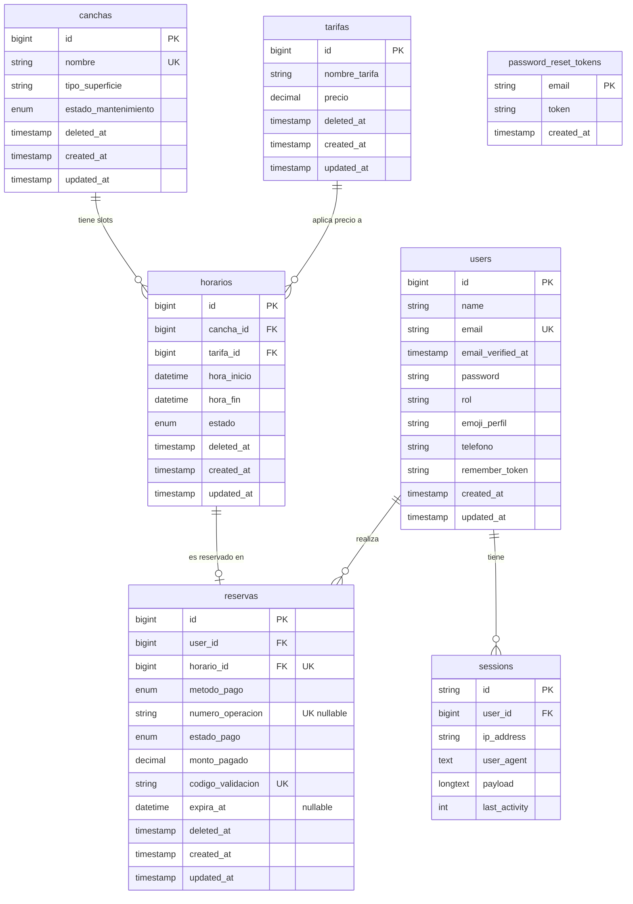

# Diagrama Entidad-Relación — Top Tennis

> **VS Code:** abrí este archivo y presioná `Ctrl+Shift+V` para ver el diagrama renderizado.



---

## Valores posibles por campo

| Tabla | Campo | Valores |
|---|---|---|
| `users` | `rol` | `admin` · `recepcionista` · `cliente` |
| `canchas` | `tipo_superficie` | `Arcilla` · `Sintética` · `Hierba` · `Dura` |
| `canchas` | `estado_mantenimiento` | `operativa` · `en_mantenimiento` |
| `horarios` | `estado` | `disponible` · `reservado` |
| `reservas` | `metodo_pago` | `Yape` · `Efectivo` |
| `reservas` | `estado_pago` | `pendiente` · `aprobado` · `anulada` |

---

## Constraints clave

| Constraint | Tabla · columna | Propósito |
|---|---|---|
| `UNIQUE` | `users.email` | Un email por cuenta |
| `UNIQUE` | `canchas.nombre` | Nombres de cancha irrepetibles |
| `UNIQUE` | `reservas.horario_id` | **Capa 1 anti-race condition**: un horario solo admite una reserva activa |
| `UNIQUE` | `reservas.numero_operacion` | Anti-reuso: un comprobante Yape no paga dos reservas |
| `UNIQUE` | `reservas.codigo_validacion` | Código de ticket único (`#TT-xxxx`) |
| `FK RESTRICT` | `horarios.cancha_id → canchas.id` | No se puede eliminar una cancha con horarios |
| `FK RESTRICT` | `horarios.tarifa_id → tarifas.id` | No se puede eliminar una tarifa en uso |
| `FK RESTRICT` | `reservas.user_id → users.id` | No se puede eliminar un usuario con reservas |
| `FK RESTRICT` | `reservas.horario_id → horarios.id` | No se puede eliminar un horario reservado |
| `INDEX` | `reservas(estado_pago, expira_at)` | Query eficiente para el job de auto-liberación de no-shows |
| `SoftDeletes` | `canchas`, `tarifas`, `horarios`, `reservas` | Borrado lógico para auditoría e integridad referencial |

---

## Relaciones Eloquent

| Modelo | Método | Tipo | Hacia |
|---|---|---|---|
| `User` | `reservas()` | `hasMany` | `Reserva` |
| `Cancha` | `horarios()` | `hasMany` | `Horario` |
| `Tarifa` | `horarios()` | `hasMany` | `Horario` |
| `Horario` | `cancha()` | `belongsTo` | `Cancha` |
| `Horario` | `tarifa()` | `belongsTo` | `Tarifa` |
| `Horario` | `reserva()` | `hasOne` | `Reserva` |
| `Reserva` | `user()` | `belongsTo` | `User` |
| `Reserva` | `horario()` | `belongsTo` | `Horario` |

---

## Flujo de estados

```
HORARIO: disponible ──────────────────► reservado
                       (store() atómico)

RESERVA (Yape):    pendiente ──► aprobado
RESERVA (Efectivo): pendiente ──► aprobado   (recepción confirma)
                    pendiente ──► anulada    (no-show: expira_at vencido)
```

### Regla de auto-liberación (no-show en Efectivo)

Al crear una reserva en Efectivo se guarda `expira_at = hora_inicio − 30 min`.  
Si llega `expira_at` sin que la recepción confirme el pago:

1. **Task Scheduler** (`reservas:liberar-vencidas`, cada minuto con `withoutOverlapping`) detecta el vencimiento y ejecuta `Reserva::liberarVencidas()`.
2. **Modo lazy** — `ReservaController@disponibles` y `@confirmar` también llaman a `liberarVencidas()` antes de mostrar datos, como red de seguridad si el scheduler no está corriendo.
3. En ambos casos: `estado_pago → anulada` y `horario.estado → disponible`.
