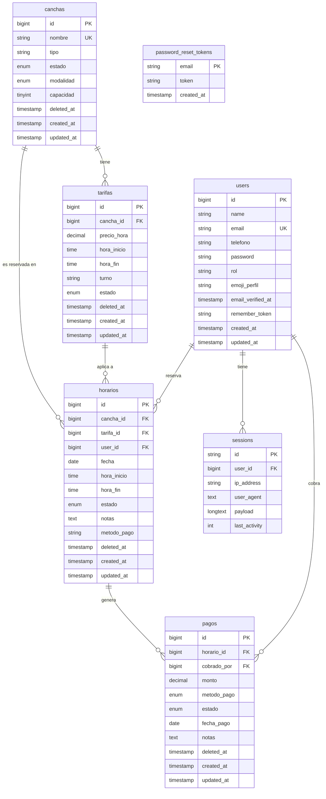

# Diagrama Entidad-Relación — Top Tennis

> **VS Code:** abrí este archivo y presioná `Ctrl+Shift+V` para ver el diagrama renderizado.

---

## Valores posibles por campo

| Tabla | Campo | Valores |
|---|---|---|
| `users` | `rol` | `admin` · `recepcionista` · `cliente` |
| `canchas` | `tipo` | `Arcilla` · `Sintética` · `Hierba` · `Dura` |
| `canchas` | `estado` | `Disponible` · `No Disponible` · `Bloqueada` |
| `canchas` | `modalidad` | `Singles` · `Dobles` |
| `tarifas` | `turno` | `Mañana` · `Tarde` · `Noche` |
| `tarifas` | `estado` | `Activa` · `Inactiva` |
| `horarios` | `estado` | `Reservado` · `Confirmado` · `Cancelado` · `Completado` |
| `horarios` | `metodo_pago` | `Efectivo` · `Tarjeta` · `Transferencia` · `Otro` *(nullable)* |
| `pagos` | `metodo_pago` | `Efectivo` · `Tarjeta` · `Transferencia` · `Otro` |
| `pagos` | `estado` | `Pendiente` · `Pagado` · `Reembolsado` |

---

## Constraints clave

| Constraint | Tabla | Detalle |
|---|---|---|
| Unique | `horarios` | `(cancha_id, fecha, hora_inicio)` — impide doble reserva a nivel BD |
| Unique | `users` | `email` |
| Unique | `canchas` | `nombre` |
| FK RESTRICT | `tarifas` | `cancha_id → canchas.id` |
| FK RESTRICT | `horarios` | `cancha_id`, `tarifa_id`, `user_id` |
| FK RESTRICT | `pagos` | `horario_id`, `cobrado_por` |
| Soft Delete | todas las tablas de negocio | `deleted_at` para auditoría |

---

## Relaciones entre modelos Laravel

| Modelo | Relación | Hacia |
|---|---|---|
| `User` | `hasMany` | `Horario` |
| `User` | `hasMany` | `Pago` *(como cobrador)* |
| `Cancha` | `hasMany` | `Tarifa` |
| `Cancha` | `hasMany` | `Horario` |
| `Tarifa` | `belongsTo` | `Cancha` |
| `Tarifa` | `hasMany` | `Horario` |
| `Horario` | `belongsTo` | `Cancha`, `Tarifa`, `User` |
| `Horario` | `hasMany` | `Pago` |
| `Pago` | `belongsTo` | `Horario` |
| `Pago` | `belongsTo` | `User` *(cobrador)* |
