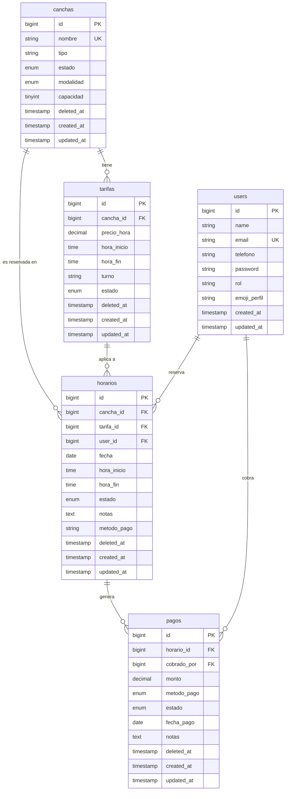

<div align="center">

# 🎾 Top Tennis

**Sistema de gestión de reservas de canchas de tenis**


</div>

---

## Descripción

Top Tennis es una aplicación web para la gestión integral de un club de tenis. Permite administrar canchas, tarifas por turno, reservas de horarios y registro de pagos — con control de acceso basado en tres roles: **Administrador**, **Recepcionista** y **Cliente**.

---

## Características

- **Gestión de canchas** — altas, bajas lógicas, superficie, modalidad (Singles/Dobles) y estado
- **Tarifas por turno** — Mañana, Tarde y Noche con precio por hora configurable por cancha
- **Reservas** — flujo completo con estados: `Reservado → Confirmado → Completado / Cancelado`
- **Pagos** — registro de cobros con método de pago y auditoría
- **Control de solapamiento** — constraint único en BD + validación en PHP para evitar doble reserva
- **Soft Deletes** en todas las tablas de negocio para trazabilidad completa
- **Roles** — Admin, Recepcionista y Cliente con permisos diferenciados

---

## Roles y accesos

| Rol | Puede hacer |
|---|---|
| `admin` | Todo — canchas, tarifas, reservas, usuarios, pagos |
| `recepcionista` | Gestionar reservas y consultar canchas/tarifas |
| `cliente` | Ver y crear sus propias reservas |

---

## Stack

| Capa | Tecnología |
|---|---|
| Backend | Laravel 12 + PHP 8.2 |
| Frontend | Blade + Tailwind CSS 3 + Vite |
| Base de datos | MySQL (XAMPP) |
| Auth | Laravel Breeze |

---

## Instalación

```bash
# 1. Clonar el repositorio
git clone https://github.com/tu-usuario/top-tennis.git
cd top-tennis

# 2. Instalar dependencias
composer install
npm install

# 3. Configurar entorno
cp .env.example .env
php artisan key:generate

# 4. Migrar y cargar datos de prueba
php artisan migrate --seed

# 5. Compilar assets y levantar servidor
npm run dev
php artisan serve
```

### Usuarios de prueba

| Email | Password | Rol |
|---|---|---|
| admin@toptennis.com | password | Administrador |
| recepcionista@toptennis.com | password | Recepcionista |
| cliente@toptennis.com | password | Cliente |

---

## Diagrama Entidad-Relación



### Valores posibles por campo

| Tabla | Campo | Valores |
|---|---|---|
| `users` | `rol` | `admin` · `recepcionista` · `cliente` |
| `canchas` | `tipo` | `Arcilla` · `Sintética` · `Hierba` · `Dura` |
| `canchas` | `estado` | `Disponible` · `No Disponible` · `Bloqueada` |
| `canchas` | `modalidad` | `Singles` · `Dobles` |
| `tarifas` | `turno` | `Mañana` · `Tarde` · `Noche` |
| `tarifas` | `estado` | `Activa` · `Inactiva` |
| `horarios` | `estado` | `Reservado` · `Confirmado` · `Cancelado` · `Completado` |
| `horarios` | `metodo_pago` | `Efectivo` · `Tarjeta` · `Transferencia` · `Otro` |
| `pagos` | `metodo_pago` | `Efectivo` · `Tarjeta` · `Transferencia` · `Otro` |
| `pagos` | `estado` | `Pendiente` · `Pagado` · `Reembolsado` |

### Constraints clave

- `horarios` → unique en `(cancha_id, fecha, hora_inicio)` — **impide doble reserva a nivel BD**
- Todas las FK usan `onDelete RESTRICT` — protege la integridad al eliminar
- Todas las tablas de negocio usan **Soft Deletes** para auditoría completa

---

## Estructura del proyecto

```
app/
├── Enums/
│   └── Rol.php                  # Enum: admin | recepcionista | cliente
├── Http/
│   ├── Controllers/
│   │   ├── CanchaController.php
│   │   ├── TarifaController.php
│   │   ├── HorarioController.php
│   │   └── ProfileController.php
│   └── Requests/                # Form Requests con validación de negocio
├── Models/
│   ├── User.php
│   ├── Cancha.php
│   ├── Tarifa.php
│   ├── Horario.php
│   └── Pago.php
database/
├── migrations/                  # 13 migraciones ordenadas
└── seeders/
    └── DatabaseSeeder.php       # Datos de prueba listos
resources/views/                 # Vistas Blade
```

---

## Desarrolladores

Proyecto desarrollado por **Renzo León** y **Diego Magallanes**  
**Dienzo INC** — Software Development

---

## Licencia

Proyecto privado — Top Tennis Club.
