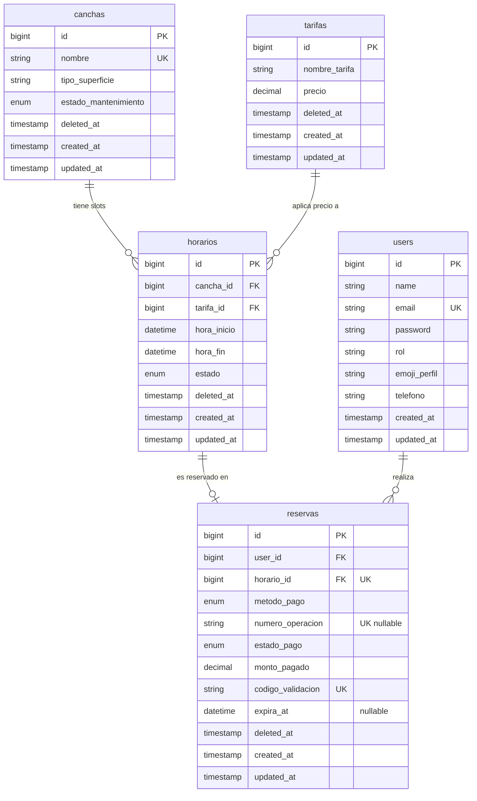

<div align="center">

# 🎾 Top Tennis

**Sistema de gestión de reservas de canchas de tenis**


</div>

---

## Descripción

Top Tennis es una aplicación web para la gestión integral de un club de tenis. Permite al administrador configurar canchas, tarifas y horarios disponibles; a los clientes reservar esos horarios pagando con **Yape** (inmediato) o **Efectivo** (presencial); y al personal confirmar cobros y monitorear ingresos desde un dashboard financiero.

---

## Características principales

- **Gestión de canchas** — altas, bajas lógicas (SoftDelete), tipo de superficie y estado de mantenimiento
- **Tarifas independientes** — precio configurable por cada tarifa, aplicable a cualquier cancha
- **Horarios (slots)** — el admin crea franjas cancha+tarifa+fecha/hora; el sistema bloquea cruces
- **Reservas con doble método de pago** — Yape (aprobado al instante) y Efectivo (pendiente con plazo)
- **Regla de no-show** — reservas en Efectivo sin pagar a 30 min del partido se anulan automáticamente y liberan el slot
- **Ticket digital** — código `#TT-xxxx` único + QR SVG (sin dependencia de GD/Imagick) descargable en PDF
- **Anti-race condition** — UPDATE atómico en BD + constraint `UNIQUE(horario_id)` impiden doble reserva simultánea
- **Dashboard financiero** — admin y recepcionista ven todas las reservas con total de ingresos confirmados
- **Control de acceso por roles** — middleware `RoleMiddleware` protege todas las rutas; intento de acceso no autorizado redirige al dashboard con mensaje de error
- **Soft Deletes** en todas las tablas de negocio para trazabilidad completa

---

## Roles y accesos

| Rol | Puede hacer |
|---|---|
| `admin` | CRUD de canchas, tarifas y horarios · ver todas las reservas · confirmar pagos en efectivo · dashboard financiero |
| `recepcionista` | Ver todas las reservas · confirmar pagos en efectivo |
| `cliente` | Ver horarios disponibles · crear reservas · ver sus tickets · cancelar sus reservas |

> Un cliente que intenta acceder a `/canchas`, `/tarifas` o `/horarios` es redirigido automáticamente al dashboard con un banner de "Acceso denegado".

---

## Stack

| Capa | Tecnología |
|---|---|
| Backend | Laravel 12 · PHP 8.5 (XAMPP) |
| Frontend | Blade · Tailwind CSS 3 (CDN) · Alpine.js 3 |
| Base de datos | MySQL vía XAMPP (`DB=top_tennis`, usuario `root`) |
| Auth | Laravel Breeze |
| PDF | `barryvdh/laravel-dompdf` |
| QR | `bacon/bacon-qr-code` con `SvgImageBackEnd` (sin GD/Imagick) |

---

## Instalación rápida (Windows + XAMPP)

```bash
# 1. Clonar el repositorio
git clone https://github.com/tu-usuario/top-tennis.git
cd top-tennis

# 2. Instalar dependencias PHP
composer install

# 3. Configurar entorno
cp .env.example .env
php artisan key:generate
# Editar .env: DB_DATABASE=top_tennis, DB_USERNAME=root, DB_PASSWORD=
```

**Opción A — Script interactivo (recomendado en Windows):**
```
migrate.bat       ← ejecuta migraciones o migrate:fresh --seed
run-app.bat       ← levanta el servidor y abre el navegador
```

**Opción B — Manual:**
```bash
php artisan migrate --seed   # crea tablas y carga datos de prueba
php artisan serve            # levanta en http://127.0.0.1:8000
```

> **Scheduler (auto-liberación de no-shows):** para activar la regla de 30 min en segundo plano, ejecutar `php artisan schedule:work` en otra terminal. Sin él, el modo *lazy* del controller aplica la regla igual al listar horarios.

---

## Usuarios de prueba (seeder)

| Email | Contraseña | Rol |
|---|---|---|
| admin@toptennis.com | password | Administrador |
| recepcionista@toptennis.com | password | Recepcionista |
| cliente@toptennis.com | password | Cliente |

El seeder también crea 3 canchas, 3 tarifas, 6 horarios a futuro y 2 reservas de ejemplo (1 Yape aprobada, 1 Efectivo pendiente).

---

## Diagrama Entidad-Relación



Ver [DIAGRAMA-ER.md](DIAGRAMA-ER.md) para el diagrama completo con constraints, relaciones Eloquent y flujo de estados.

---

## Estructura del proyecto

```
app/
├── Console/Commands/
│   └── LiberarReservasVencidas.php   # Artisan: reservas:liberar-vencidas
├── Enums/
│   └── Rol.php                       # Enum: admin | recepcionista | cliente
├── Http/
│   ├── Controllers/
│   │   ├── CanchaController.php      # CRUD admin (canchas)
│   │   ├── TarifaController.php      # CRUD admin (tarifas)
│   │   ├── HorarioController.php     # CRUD admin (slots)
│   │   └── ReservaController.php     # Flujo cliente + ticket + PDF + dashboard
│   ├── Middleware/
│   │   └── RoleMiddleware.php        # Guardian de rutas por rol
│   └── Requests/
│       ├── StoreReservaRequest.php   # Validación de reserva + regla 30 min Efectivo
│       ├── StoreHorarioRequest.php   # Anti-cruce de horarios
│       └── ...
├── Models/
│   ├── Cancha.php
│   ├── Tarifa.php
│   ├── Horario.php                   # scopeReservables()
│   └── Reserva.php                   # scopeVencidas() · liberarVencidas() · qrSvg()
database/
├── migrations/                       # 10 migraciones ordenadas
└── seeders/
    └── DatabaseSeeder.php            # 3 usuarios · 3 canchas · 3 tarifas · 6 slots · 2 reservas
resources/views/
├── reservas/
│   ├── disponibles.blade.php
│   ├── confirmar.blade.php           # QR Yape + formulario de pago
│   ├── index.blade.php               # Dashboard financiero (staff) / Mis reservas (cliente)
│   ├── ticket.blade.php              # Ticket digital con QR SVG
│   └── ticket-pdf.blade.php          # Versión PDF (dompdf)
├── canchas/ tarifas/ horarios/       # Vistas CRUD admin
└── errors/                           # 403 · 404 · 419 · 429 · 500 personalizados
routes/
├── web.php                           # Rutas protegidas por middleware role:admin / role:admin,recepcionista
└── console.php                       # Schedule: reservas:liberar-vencidas cada minuto
```

---

## Seguridad de rutas

| Ruta | Middleware | Quién accede |
|---|---|---|
| `/canchas/*`, `/tarifas/*`, `/horarios/*` | `auth + role:admin` | Solo Admin |
| `/reservas/{id}/confirmar-pago` | `auth + role:admin,recepcionista` | Admin y Recepcionista |
| `/reservar`, `/reservas/*` | `auth` | Cualquier usuario autenticado |
| Ticket/cancelar ajeno | `auth` + `autorizar()` en controller | Dueño o staff |

---

## Desarrolladores

Proyecto desarrollado por **Renzo León** y **Diego Magallanes**  
**Dienzo INC** — Software Development

---

## Licencia

Proyecto privado — Top Tennis Club.
