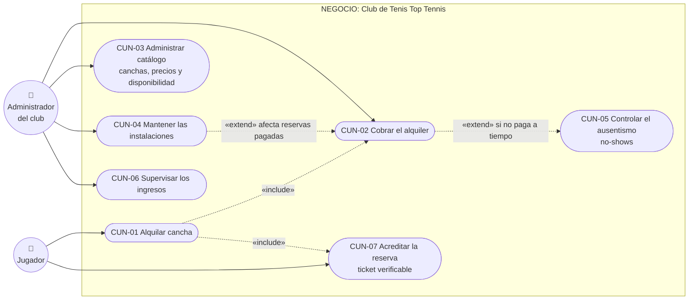

# Casos de Uso de Negocio — Top Tennis

> Vista de alto nivel: qué hace el **negocio** (el club de tenis), independientemente de cómo lo implementa el software.
> Para la vista de sistema (pantallas, validaciones, código) ver [casos-de-uso.md](casos-de-uso.md).
>
> **VS Code:** `Ctrl+Shift+V` para renderizar los diagramas.

---

## Actores de negocio

| Actor | Rol en el negocio |
|---|---|
| **Jugador** | Persona que quiere alquilar una cancha para jugar (puede o no tener cuenta) |
| **Club Top Tennis** | La organización: administra las instalaciones, fija precios y cobra los alquileres |
| **Administrador del club** | Representa al club: gestiona el catálogo, atiende el mostrador y supervisa las finanzas |

---

## Diagrama de casos de uso de negocio

---

## Descripción de cada caso de uso de negocio

### CUN-01 — Alquilar cancha
**Objetivo del negocio:** vender el uso de una cancha por bloques de una hora.
**Descripción:** el jugador consulta la disponibilidad, elige cancha y hora, y formaliza el alquiler pagando. El club garantiza que un mismo bloque no se venda dos veces.
**Valor:** es la fuente principal de ingresos del club.
**Soportado por:** UC-03, UC-04 del [sistema](casos-de-uso.md).

### CUN-02 — Cobrar el alquiler
**Objetivo del negocio:** asegurar el pago de cada reserva.
**Descripción:** el club acepta dos modalidades: pago digital inmediato (Yape, con comprobante) o pago presencial en el mostrador (Efectivo, con plazo límite). El administrador registra los cobros presenciales.
**Valor:** flujo de caja controlado; ninguna reserva ocupa cancha sin pago o compromiso de pago.
**Soportado por:** UC-04, UC-31.

### CUN-03 — Administrar catálogo
**Objetivo del negocio:** decidir qué se ofrece y a qué precio.
**Descripción:** el administrador da de alta canchas (superficie, modalidad, iluminación), define tarifas (día/noche u ofertas) y publica la disponibilidad en bloques de una hora.
**Valor:** flexibilidad comercial: precios distintos por franja y ofertas puntuales sin tocar reservas ya vendidas.
**Soportado por:** UC-20 a UC-25.

### CUN-04 — Mantener las instalaciones
**Objetivo del negocio:** conservar las canchas en condiciones de juego.
**Descripción:** cuando una cancha requiere reparación, el club la retira temporalmente de la oferta, avisa a los clientes afectados y les devuelve el dinero de las reservas pagadas dentro del periodo.
**Valor:** protege la reputación del club; nadie llega a jugar a una cancha cerrada.
**Soportado por:** UC-20a, UC-20b, UC-41.

### CUN-05 — Controlar el ausentismo (no-shows)
**Objetivo del negocio:** no perder ingresos por reservas que nunca se pagan.
**Descripción:** si un jugador reservó con pago presencial y no se presenta a pagar hasta 30 minutos antes de su hora, el club libera el bloque y lo vuelve a ofrecer.
**Valor:** maximiza la ocupación real de las canchas.
**Soportado por:** UC-40 (proceso automático).

### CUN-06 — Supervisar los ingresos
**Objetivo del negocio:** saber cuánto y por qué canal se cobra.
**Descripción:** el administrador consulta el total cobrado (solo pagos confirmados) y puede desglosarlo por método de pago.
**Valor:** control financiero y detección de descuadres de caja.
**Soportado por:** UC-26, UC-30.

### CUN-07 — Acreditar la reserva
**Objetivo del negocio:** que el jugador demuestre en la puerta que su reserva es legítima.
**Descripción:** cada alquiler emite un comprobante con código único (TT-XXXX) y código QR, presentable en pantalla o impreso (PDF).
**Valor:** control de acceso rápido y sin discusiones en el mostrador.
**Soportado por:** UC-05, UC-35.

---

## Trazabilidad negocio → sistema

| Caso de uso de negocio | Casos de uso de sistema | Módulo de código |
|---|---|---|
| CUN-01 Alquilar cancha | UC-03, UC-04 | `ReservaController` (disponibles, confirmar, store) |
| CUN-02 Cobrar el alquiler | UC-04, UC-31 | `ReservaController` (store, confirmarPago) |
| CUN-03 Administrar catálogo | UC-20—UC-25 | `CanchaController`, `TarifaController`, `HorarioController` |
| CUN-04 Mantener instalaciones | UC-20a, UC-20b, UC-41 | `CanchaController` (ponerMantenimiento, restaurar) |
| CUN-05 Controlar no-shows | UC-40 | `Reserva::liberarVencidas()` + comando + scheduler |
| CUN-06 Supervisar ingresos | UC-26, UC-30 | Dashboard (`web.php`) + `ReservaController::index()` |
| CUN-07 Acreditar la reserva | UC-05, UC-35 | `Reserva::qrSvg()` + `ReservaController` (ticket, descargarTicket) |
