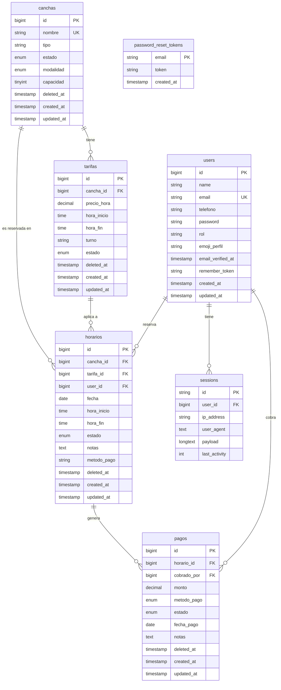

# Diagrama Entidad-Relación — Top Tennis

> Abrí este archivo en VS Code y presioná `Ctrl+Shift+V` para ver el diagrama renderizado.

## Leyenda de roles (`users.rol`)
| Valor | Descripción |
|---|---|
| `admin` | Acceso total |
| `recepcionista` | Gestión de reservas y canchas |
| `cliente` | Solo sus propias reservas |

## Constraints importantes
- `horarios`: unique en `(cancha_id, fecha, hora_inicio)` — evita doble reserva
- `tarifas.cancha_id`: `onDelete RESTRICT` — no se puede borrar cancha con tarifas
- `horarios.cancha_id / tarifa_id / user_id`: `onDelete RESTRICT`
- `pagos.horario_id / cobrado_por`: `onDelete RESTRICT`
- Todas las tablas de negocio usan **Soft Deletes** para auditoría
