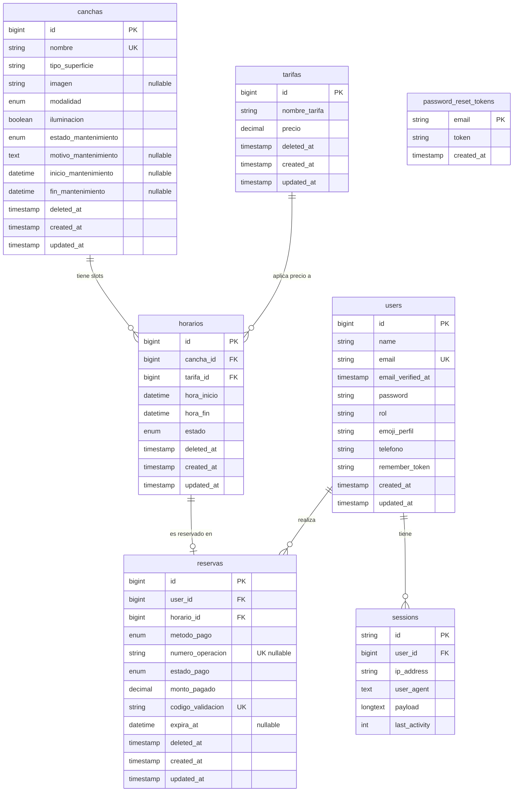

# Modelo de Datos — Top Tennis

> **VS Code:** abrí este archivo y presioná `Ctrl+Shift+V` para ver el diagrama renderizado.
>
> Documentación relacionada: [Arquitectura](arquitectura.md) · [Reglas de negocio](reglas-de-negocio.md) · [Casos de uso](casos-de-uso.md) · [Índice de código](../INDEX.md)

---

## Diagrama Entidad-Relación



---

## Valores posibles por campo

| Tabla | Campo | Valores |
|---|---|---|
| `users` | `rol` | `admin` · `cliente` |
| `canchas` | `tipo_superficie` | `Arcilla` · `Sintética` · `Hierba` · `Dura` (los registros antiguos con `Sintética` fueron renombrados a `Césped Artificial` por migración) |
| `canchas` | `modalidad` | `Singles` · `Dobles` · `Ambos` |
| `canchas` | `estado_mantenimiento` | `operativa` · `en_mantenimiento` |
| `horarios` | `estado` | `disponible` · `reservado` |
| `reservas` | `metodo_pago` | `Yape` · `Efectivo` |
| `reservas` | `estado_pago` | `pendiente` · `aprobado` · `anulada` · `cancelado_por_mantenimiento` |

---

## Constraints clave

| Constraint | Tabla · columna | Propósito |
|---|---|---|
| `UNIQUE` | `users.email` | Un email por cuenta |
| `UNIQUE` | `canchas.nombre` | Nombres de cancha irrepetibles |
| `UNIQUE` | `reservas.numero_operacion` | Anti-reuso: un comprobante Yape no paga dos reservas |
| `UNIQUE` | `reservas.codigo_validacion` | Código de ticket único (`TT-xxxx`) |
| `FK RESTRICT` | `horarios.cancha_id → canchas.id` | No se puede eliminar una cancha con horarios |
| `FK RESTRICT` | `horarios.tarifa_id → tarifas.id` | No se puede eliminar una tarifa en uso |
| `FK RESTRICT` | `reservas.user_id → users.id` | No se puede eliminar un usuario con reservas |
| `FK RESTRICT` | `reservas.horario_id → horarios.id` | No se puede eliminar un horario reservado |
| `INDEX` | `reservas(estado_pago, expira_at)` | Query eficiente para la auto-liberación de no-shows |
| `SoftDeletes` | `canchas`, `tarifas`, `horarios`, `reservas` | Borrado lógico para auditoría e integridad referencial |

> **Nota histórica:** `reservas.horario_id` tuvo un constraint `UNIQUE` que fue **eliminado** por la migración `drop_unique_horario_id_from_reservas_table`, porque bloqueaba las re-reservas de un horario cuya reserva anterior fue cancelada o anulada (el registro sigue en la tabla por SoftDeletes). La protección contra la doble reserva simultánea recae en el **UPDATE atómico condicional** (`WHERE estado = 'disponible'`) que ejecuta `ReservaController::store()`.

---

## Relaciones Eloquent

| Modelo | Método | Tipo | Hacia |
|---|---|---|---|
| `User` | `reservas()` | `hasMany` | `Reserva` |
| `Cancha` | `horarios()` | `hasMany` | `Horario` |
| `Tarifa` | `horarios()` | `hasMany` | `Horario` |
| `Horario` | `cancha()` | `belongsTo` | `Cancha` |
| `Horario` | `tarifa()` | `belongsTo` | `Tarifa` |
| `Horario` | `reserva()` | `hasOne` | `Reserva` |
| `Reserva` | `user()` | `belongsTo` | `User` |
| `Reserva` | `horario()` | `belongsTo` | `Horario` |

---

## Flujo de estados

```
HORARIO:  disponible ──────────────────► reservado
                        (store() atómico)
          reservado ───────────────────► disponible
                        (cancelación o no-show)

RESERVA (Yape):     [se crea directamente en] aprobado
RESERVA (Efectivo): pendiente ──► aprobado                      (el administrador confirma el cobro)
                    pendiente ──► anulada                       (no-show: expira_at vencido)
RESERVA (ambos):    aprobado  ──► cancelado_por_mantenimiento   (la cancha entró en mantenimiento)
```

Las reglas que gobiernan estas transiciones están detalladas en [reglas-de-negocio.md](reglas-de-negocio.md).
